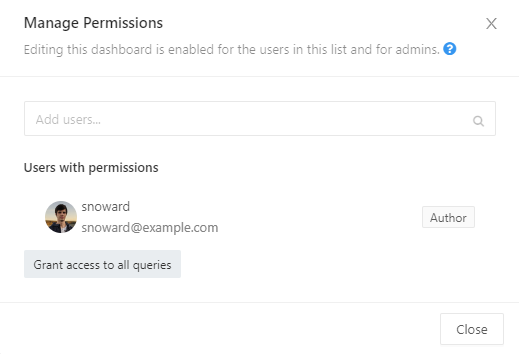

This extension adds a button "Grant access to all queries" in modal window "Manage access" on dashboard page.
Under the hood, it iterates over all queries on current dashboard page and tries granting access to them via internal redash api call.

### How to install

1) Go to [releases page](https://github.com/snoward/redash-extension/releases)
2) Download latest release, unzip it
3) Goto `chrome://extensions`, click on "Load Unpacked" and select your folder

### How it looks like

